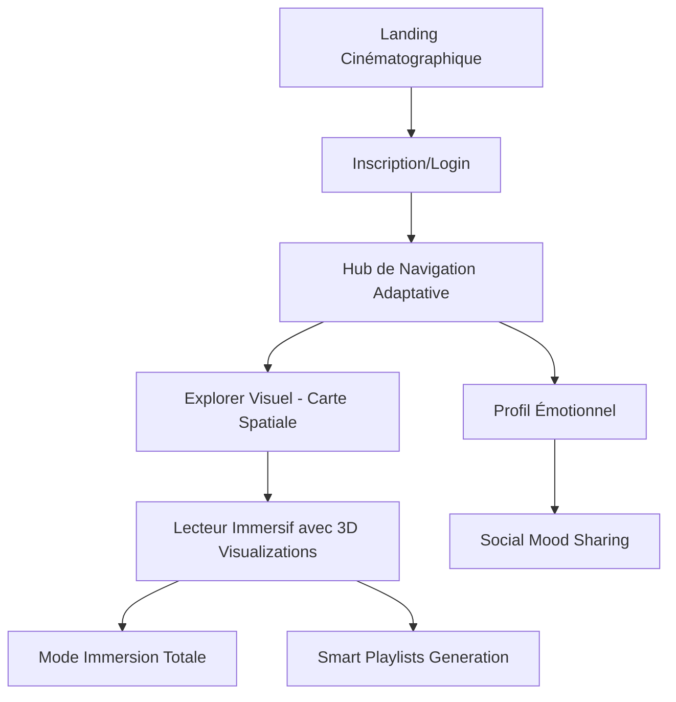

## 1. Product Overview

**Synesthetic** révolutionne l'écoute musicale en transformant chaque morceau en un voyage sensoriel immersif. Cette plateforme de streaming nouvelle génération fusionne audio, visuel et émotion pour créer une expérience qui transcende la simple écoute.

Conçue pour les amateurs de musique qui recherchent plus qu'une plateforme de streaming, Synesthetic devient un compagnon émotionnel qui adapte son interface, ses visualisations et ses recommandations à votre état d'esprit, votre environnement et vos habitudes d'écoute. L'objectif est de créer le Netflix de la musique, mais avec une immersion qui dépasse Spotify et Apple Music.

## 2. Core Features

### 2.1 User Roles

| Role | Registration Method | Core Permissions |
|------|---------------------|------------------|
| Free Listener | Email/Social login | Écoute limitée (10h/mois), publicités, qualité standard |
| Premium Explorer | Subscription $9.99/mois | Écoute illimitée, haute qualité, visualisations 3D, mode immersion |
| Premium+ Voyager | Subscription $19.99/mois | Toutes les fonctionnalités premium + mode réalité augmentée, téléchargements spatiaux, profils multi-utilisateurs |

### 2.2 Feature Module

Notre plateforme immersive se compose des expériences suivantes :

1. **Landing Cinématographique** : Introduction immersive avec transitions fluides, découverte visuelle du concept
2. **Hub de Navigation** : Interface adaptative qui transforme son apparence selon le genre musical
3. **Lecteur Immersif** : Centre névralgique avec visualisations 3D, mode immersion totale, contrôles gestuels
4. **Explorer Visuel** : Découverte musicale par univers visuels, navigation spatiale entre genres
5. **Profil Émotionnel** : Tableau de bord personnalisé avec mood mapping, statistiques émotionnelles, journal d'écoute

### 2.3 Page Details

| Page Name | Module Name | Feature description |
|-----------|-------------|---------------------|
| Landing Cinématographique | Hero Section | Vidéo d'ambiance en plein écran avec transition de couleurs selon l'heure, parallax scrolling avec profondeur de champ, CTA animé qui pulse au rythme d'une playlist démo |
| Landing Cinématographique | Feature Showcase | Carrousel 3D des fonctionnalités principales avec prévisualisation en temps réel, animations de transition cinématographiques (60fps), scroll-triggered animations |
| Hub de Navigation | Adaptive Interface | Interface qui change de palette de couleurs, de typographie et d'animations selon le genre musical sélectionné (ex: électro = néon cyberpunk, jazz = textures vintage) |
| Hub de Navigation | Genre Universe | Navigation visuelle entre univers musicaux avec transitions fluides, prévisualisation audio au survol, effets de particules qui réagissent au beat |
| Lecteur Immersif | 3D Visualizations | Visualiseurs audio en 3D temps réel (ondes, particules, fractales) qui réagissent à la fréquence et au tempo, mode réalité augmentée disponible |
| Lecteur Immersif | Immersion Mode | Interface complètement minimale avec seulement les contrôles essentiels, fond noir profond avec visualisations sublimes, mode "cinéma" pour l'écoute nocturne |
| Lecteur Immersif | Gesture Controls | Contrôles par gestes sur mobile (swipe pour changer de piste, pinch pour volume), raccourcis clavier élégants sur desktop |
| Explorer Visuel | Spatial Discovery | Carte visuelle des genres musicaux avec navigation zoom/pan, découvertes basées sur l'heure, la météo, l'activité, algorithmes de mood mapping |
| Explorer Visuel | Smart Playlists | Création automatique de playlists basées sur l'humeur détectée, l'activité choisie, les habitudes d'écoute, avec titres générés par IA |
| Profil Émotionnel | Mood Analytics | Tracking émotionnel de l'écoute avec graphiques temporels, corrélation entre genres et humeurs, insights personnalisés |
| Profil Émotionnel | Social Features | Partage d'expériences immersives, création de mood boards collaboratifs, défis d'écoute entre amis |

## 3. Core Process

### Flow Utilisateur Premium Explorer

L'utilisateur arrive sur la landing page cinématographique où une vidéo d'ambiance s'adapte à l'heure de la journée. Le scroll déclenche des transitions fluides qui présentent le concept de voyage musical. Après l'inscription, l'utilisateur est guidé vers le hub de navigation où il découvre l'interface adaptative qui transforme son apparence selon le premier genre musical exploré.

La découverte se fait via la carte visuelle spatiale où chaque genre est représenté par un univers unique. En sélectionnant "Electronic", l'interface adopte instantanément un thème néon cyberpunk avec des particules qui réagissent au beat. Le lecteur immersif devient alors le centre de l'attention avec ses visualisations 3D qui dansent avec la musique.

Le mode immersion peut être activé d'un simple geste, transformant l'interface en une expérience minimale où seules les visualisations et les contrôles essentiels subsistent. Les playlists intelligentes se génèrent automatiquement basées sur l'humeur détectée, l'heure, et même la météo locale.

## 4. User Interface Design

### 4.1 Design Style

**Palette de Couleurs Primaires:**
- Deep Space Black (#000814) - fond principal pour l'immersion totale
- Cosmic Purple (#7209B7) - accent principal pour les interactions
- Aurora Blue (#4CC9F0) - secondaire pour les états actifs
- Stardust Silver (#B8B8FF) - pour le texte et les détails

**Palette Adaptative par Genre:**
- Electronic: Neon Pink (#FF006E), Cyber Blue (#3A86FF), Electric Purple (#8338EC)
- Jazz: Warm Amber (#FFB700), Vintage Gold (#FB8500), Deep Burgundy (#6A040F)
- Classical: Pearl White (#F8F9FA), Royal Gold (#E9C46A), Midnight Blue (#264653)

**Typography:**
- Headers: "Inter" avec gradients dynamiques qui changent selon le mood
- Body: "SF Pro Display" pour la lisibilité premium
- Animation: Lettres qui réagissent au beat avec micro-movements

**Composants UI:**
- Boutons: Design glassmorphism avec effets de reflet, bordures animées
- Cards: Effets de profondeur avec ombres dynamiques, hover states avec transformations 3D
- Navigation: Icons minimalistes qui s'animent au survol, transitions fluides (300ms ease-out)

### 4.2 Page Design Overview

| Page Name | Module Name | UI Elements |
|-----------|-------------|-------------|
| Landing Cinématographique | Hero Section | Vidéo background en 16:9 avec overlay gradient radial, CTA principal avec effet pulse synchronisé à 128BPM, scroll indicator animé en forme d'onde |
| Hub de Navigation | Adaptive Header | Navigation qui change de couleur avec transition de 500ms, logo animé qui pulse doucement, search bar avec effet glassmorphism |
| Hub de Navigation | Genre Cards | Cards rectangulaires avec images de fond floutées (effet bokeh), titres avec typographie adaptative, hover effects avec scale(1.05) et rotationY(5deg) |
| Lecteur Immersif | Main Player | Circle progress bar avec gradient dynamique, boutons de contrôle circulaires avec effets néon, visualiseur 3D en arrière-plan prenant 60% de l'écran |
| Lecteur Immersif | Immersion Toggle | Bouton flottant en bas à droite avec icône qui transforme de éye à eye-slash, activation avec animation de fondu complet de l'interface |
| Explorer Visuel | Spatial Map | Carte interactive avec nodes représentant genres, connections animées entre styles similaires, zoom avec molette fluide, parallax au mouvement de souris |
| Profil Émotionnel | Mood Timeline | Graphique en aires avec dégradés émotionnels, points de données interactifs montrant morceaux écoutés, animations d'apparition progressives |

### 4.3 Responsiveness

**Mobile-First Approach** avec breakpoints stratégiques :
- Mobile (< 768px): Interface minimaliste avec gestes principaux, visualisations simplifiées mais immersives
- Tablet (768px - 1024px): Layout adaptatif avec colonnes flexibles, interactions tactiles optimisées
- Desktop (> 1024px): Expérience complète avec visualisations 3D avancées, multi-fenêtres support

**Optimisations Touch** :
- Swipe horizontal pour changer de piste (avec animation de carte)
- Pinch pour ajuster volume (avec feedback visuel)
- Long-press pour activer mode immersion
- Gestures multi-touch pour contrôler visualisations (rotation, zoom)

**Performance Targets** :
- 60fps constant sur toutes les animations
- Temps de chargement < 2 secondes
- Transitions < 300ms pour toutes les interactions
- Visualisations audio avec latence < 50ms