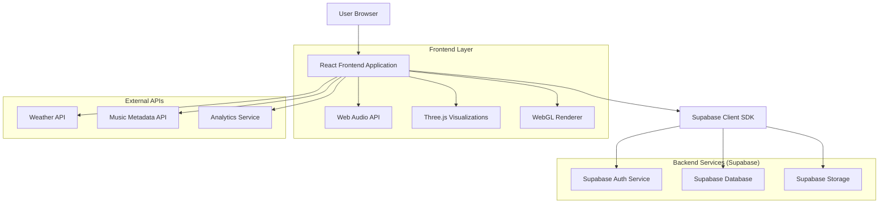
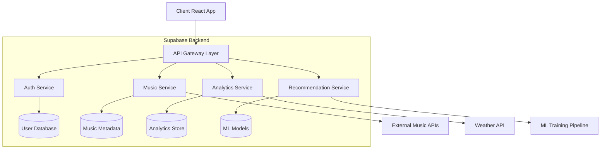
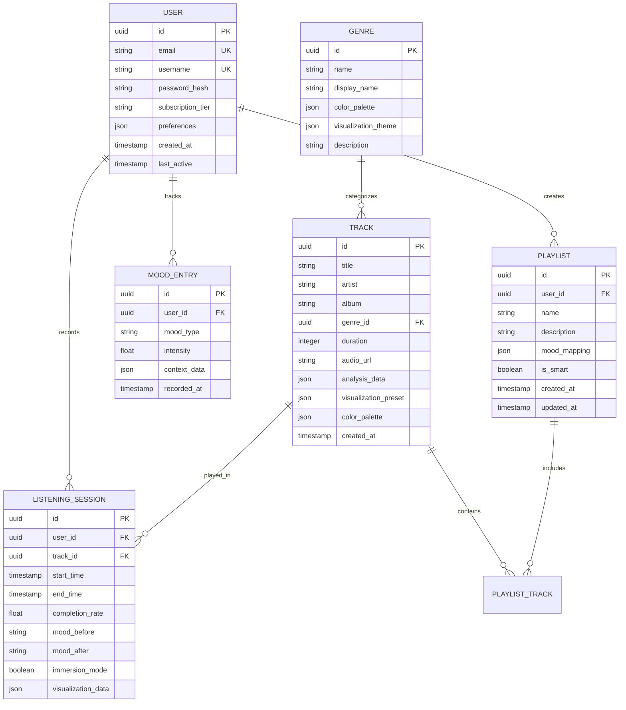

## 1. Architecture design



## 2. Technology Description

**Frontend Stack:**
- React@18.2.0 avec TypeScript pour la sécurité des types
- Next.js@13 pour le SSR et les performances optimales
- Three.js@0.158.0 pour les visualisations 3D immersives
- Web Audio API pour l'analyse audio temps réel
- Framer Motion@10.16 pour les animations fluides 60fps
- Tailwind CSS@3.3 pour le styling responsive premium
- Zustand@4.4 pour la gestion d'état légère

**Backend & Infrastructure:**
- Supabase pour l'authentification, la base de données PostgreSQL et le stockage d'objets
- Edge Functions pour les traitements serveur légers (recommandations, mood analysis)
- Real-time subscriptions pour les fonctionnalités sociales

**Audio Processing:**
- Web Audio API pour l'analyse fréquentielle temps réel
- Canvas API et WebGL pour le rendu des visualisations
- Audio Worklet pour les performances optimales du traitement audio

## 3. Route definitions

| Route | Purpose |
|-------|---------|
| / | Landing page cinématographique avec vidéo d'ambiance et CTA |
| /auth/login | Page d'authentification avec design immersif |
| /auth/register | Inscription avec personnalisation initiale du mood |
| /hub | Interface adaptative principale avec navigation par genres |
| /player | Lecteur immersif avec visualisations 3D et mode immersion |
| /explorer | Carte spatiale de découverte musicale avec navigation visuelle |
| /playlists | Gestion des playlists intelligentes et mood-based |
| /profile | Profil utilisateur avec analytics émotionnels et mood timeline |
| /social | Partage d'expériences et mood boards collaboratifs |
| /settings | Personnalisation de l'interface et préférences audio |

## 4. API definitions

### 4.1 Authentication APIs

```
POST /api/auth/register
```

Request:
| Param Name | Param Type | isRequired | Description |
|------------|------------|------------|-------------|
| email | string | true | Email de l'utilisateur |
| password | string | true | Mot de passe (min 8 caractères) |
| username | string | true | Nom d'utilisateur unique |
| initial_mood | string | false | Mood initial sélectionné (happy, chill, energetic, melancholic) |

Response:
```json
{
  "user": {
    "id": "uuid",
    "email": "user@example.com",
    "username": "voyageur_musical",
    "subscription_tier": "free",
    "created_at": "2024-01-15T10:30:00Z"
  },
  "session": {
    "access_token": "jwt_token",
    "refresh_token": "refresh_token",
    "expires_in": 3600
  }
}
```

### 4.2 Music APIs

```
GET /api/music/track/:id
```

Response:
```json
{
  "id": "track_uuid",
  "title": "Midnight Voyage",
  "artist": "Cosmic Dreamer",
  "album": "Stellar Journey",
  "duration": 245,
  "genre": "electronic",
  "mood_tags": ["chill", "spacey", "night"],
  "audio_url": "https://cdn.synesthetic.app/audio/track.mp3",
  "visualization_preset": "cosmic_particles",
  "color_palette": ["#7209B7", "#4CC9F0", "#B8B8FF"],
  "analysis": {
    "bpm": 128,
    "key": "C minor",
    "energy": 0.65,
    "danceability": 0.72
  }
}
```

```
GET /api/music/recommendations
```

Query Parameters:
| Param Name | Param Type | isRequired | Description |
|------------|------------|------------|-------------|
| current_track | string | false | ID du morceau actuel |
| mood | string | true | Mood actuel (happy, chill, energetic, melancholic) |
| time_of_day | string | false | Heure actuelle (morning, afternoon, evening, night) |
| weather | string | false | Conditions météo actuelles |
| activity | string | false | Activité sélectionnée (work, relax, workout, party) |

### 4.3 Analytics APIs

```
POST /api/analytics/listening-session
```

Request:
```json
{
  "track_id": "track_uuid",
  "start_time": "2024-01-15T14:30:00Z",
  "end_time": "2024-01-15T14:34:05Z",
  "completion_rate": 0.95,
  "mood_before": "neutral",
  "mood_after": "relaxed",
  "visualization_used": "cosmic_particles",
  "immersion_mode": true
}
```

## 5. Server architecture diagram



## 6. Data model

### 6.1 Data model definition



### 6.2 Data Definition Language

**User Table (users)**
```sql
-- create table
CREATE TABLE users (
    id UUID PRIMARY KEY DEFAULT gen_random_uuid(),
    email VARCHAR(255) UNIQUE NOT NULL,
    username VARCHAR(50) UNIQUE NOT NULL,
    password_hash VARCHAR(255) NOT NULL,
    subscription_tier VARCHAR(20) DEFAULT 'free' CHECK (subscription_tier IN ('free', 'premium', 'premium_plus')),
    preferences JSONB DEFAULT '{"theme": "dark", "auto_play": true, "quality": "high"}',
    created_at TIMESTAMP WITH TIME ZONE DEFAULT NOW(),
    last_active TIMESTAMP WITH TIME ZONE DEFAULT NOW()
);

-- create indexes
CREATE INDEX idx_users_email ON users(email);
CREATE INDEX idx_users_username ON users(username);
CREATE INDEX idx_users_subscription ON users(subscription_tier);

-- RLS policies
ALTER TABLE users ENABLE ROW LEVEL SECURITY;

CREATE POLICY "Users can view their own profile" ON users
    FOR SELECT USING (auth.uid() = id);

CREATE POLICY "Users can update their own profile" ON users
    FOR UPDATE USING (auth.uid() = id);
```

**Tracks Table (tracks)**
```sql
-- create table
CREATE TABLE tracks (
    id UUID PRIMARY KEY DEFAULT gen_random_uuid(),
    title VARCHAR(255) NOT NULL,
    artist VARCHAR(255) NOT NULL,
    album VARCHAR(255),
    genre_id UUID REFERENCES genres(id),
    duration INTEGER NOT NULL, -- in seconds
    audio_url TEXT NOT NULL,
    analysis_data JSONB DEFAULT '{}',
    visualization_preset VARCHAR(50) DEFAULT 'default',
    color_palette JSONB DEFAULT '["#7209B7", "#4CC9F0"]',
    mood_tags TEXT[] DEFAULT '{}',
    created_at TIMESTAMP WITH TIME ZONE DEFAULT NOW()
);

-- create indexes
CREATE INDEX idx_tracks_genre ON tracks(genre_id);
CREATE INDEX idx_tracks_created ON tracks(created_at DESC);
CREATE INDEX idx_tracks_mood ON tracks USING GIN(mood_tags);

-- RLS policies
ALTER TABLE tracks ENABLE ROW LEVEL SECURITY;
CREATE POLICY "Anyone can view tracks" ON tracks FOR SELECT USING (true);
```

**Listening Sessions Table (listening_sessions)**
```sql
-- create table
CREATE TABLE listening_sessions (
    id UUID PRIMARY KEY DEFAULT gen_random_uuid(),
    user_id UUID REFERENCES users(id) NOT NULL,
    track_id UUID REFERENCES tracks(id) NOT NULL,
    start_time TIMESTAMP WITH TIME ZONE NOT NULL,
    end_time TIMESTAMP WITH TIME ZONE,
    completion_rate FLOAT CHECK (completion_rate >= 0 AND completion_rate <= 1),
    mood_before VARCHAR(50),
    mood_after VARCHAR(50),
    immersion_mode BOOLEAN DEFAULT false,
    visualization_data JSONB DEFAULT '{}',
    created_at TIMESTAMP WITH TIME ZONE DEFAULT NOW()
);

-- create indexes
CREATE INDEX idx_sessions_user ON listening_sessions(user_id);
CREATE INDEX idx_sessions_track ON listening_sessions(track_id);
CREATE INDEX idx_sessions_start_time ON listening_sessions(start_time DESC);
CREATE INDEX idx_sessions_mood ON listening_sessions(mood_before, mood_after);

-- RLS policies
ALTER TABLE listening_sessions ENABLE ROW LEVEL SECURITY;

CREATE POLICY "Users can view their own sessions" ON listening_sessions
    FOR SELECT USING (auth.uid() = user_id);

CREATE POLICY "Users can create their own sessions" ON listening_sessions
    FOR INSERT WITH CHECK (auth.uid() = user_id);
```

**Genres Table (genres)**
```sql
-- create table
CREATE TABLE genres (
    id UUID PRIMARY KEY DEFAULT gen_random_uuid(),
    name VARCHAR(50) UNIQUE NOT NULL,
    display_name VARCHAR(100) NOT NULL,
    color_palette JSONB DEFAULT '{"primary": "#7209B7", "secondary": "#4CC9F0"}',
    visualization_theme JSONB DEFAULT '{"particles": true, "3d": true}',
    description TEXT,
    created_at TIMESTAMP WITH TIME ZONE DEFAULT NOW()
);

-- insert initial genres
INSERT INTO genres (name, display_name, color_palette, visualization_theme, description) VALUES
('electronic', 'Electronic', '{"primary": "#FF006E", "secondary": "#3A86FF", "accent": "#8338EC"}', '{"particles": true, "3d": true, "neon": true}', 'Pulsating electronic beats and synth landscapes'),
('jazz', 'Jazz', '{"primary": "#FFB700", "secondary": "#FB8500", "accent": "#6A040F"}', '{"particles": false, "3d": false, "vintage": true}', 'Smooth jazz with vintage textures and warm tones'),
('classical', 'Classical', '{"primary": "#F8F9FA", "secondary": "#E9C46A", "accent": "#264653"}', '{"particles": false, "3d": true, "elegant": true}', 'Timeless classical compositions with elegant visualizations');

-- RLS policies
ALTER TABLE genres ENABLE ROW LEVEL SECURITY;
CREATE POLICY "Anyone can view genres" ON genres FOR SELECT USING (true);
```

**Edge Function: Smart Recommendations**
```sql
-- Grant access for edge functions
GRANT SELECT ON tracks TO authenticated;
GRANT SELECT ON listening_sessions TO authenticated;
GRANT INSERT ON listening_sessions TO authenticated;
GRANT SELECT ON genres TO authenticated;
```

### 6.3 Performance Optimizations

**Caching Strategy:**
- Redis pour le cache des visualisations fréquemment utilisées
- CDN pour les assets audio et les images de profil
- IndexedDB côté client pour le cache offline des morceaux écoutés récemment

**Database Optimizations:**
- Partitionnement des tables de sessions par date
- Materialized views pour les analytics fréquents
- Indexes composites sur (user_id, created_at) pour les requêtes temporelles

**Frontend Optimizations:**
- Code splitting par route avec Next.js dynamic imports
- Lazy loading des visualisations 3D complexes
- Service Worker pour le support offline et le préchargement intelligent